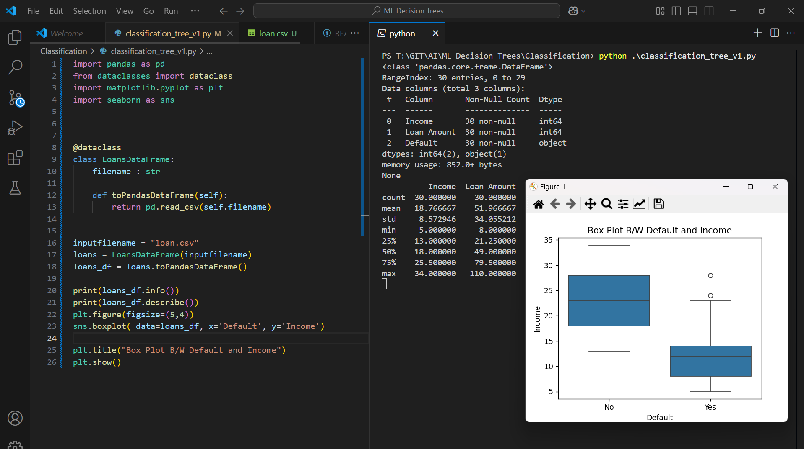
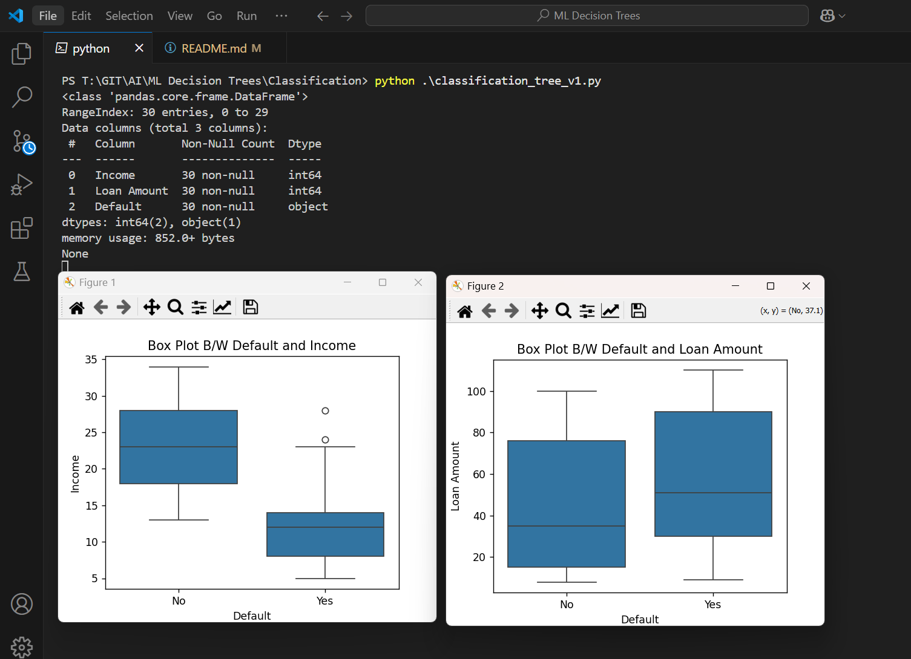
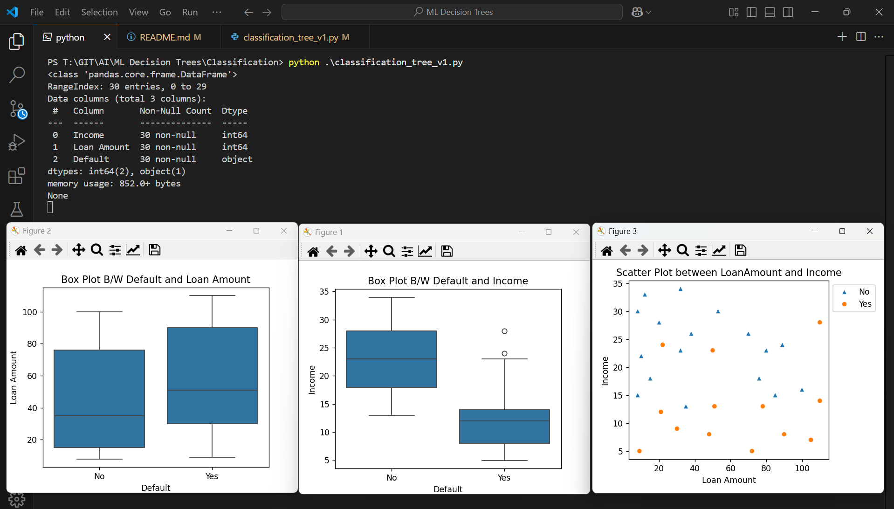

Execute
```py
import pandas as pd
from dataclasses import dataclass
import matplotlib.pyplot as plt
import seaborn as sns


@dataclass
class LoansDataFrame:
    filename : str

    def toPandasDataFrame(self):
        return pd.read_csv(self.filename)
    

inputfilename = "loan.csv"
loans = LoansDataFrame(inputfilename)
loans_df = loans.toPandasDataFrame()

print(loans_df.info())
print(loans_df.describe())
plt.figure(figsize=(5,4))
sns.boxplot( data=loans_df, x='Default', y='Income')

plt.title("Box Plot B/W Default and Income")
plt.show()
```

Outcome
Box Plot b/w Default and Income


```py
import pandas as pd
from dataclasses import dataclass
import matplotlib.pyplot as plt
import seaborn as sns


@dataclass
class LoansDataFrame:
    filename : str

    def toPandasDataFrame(self):
        return pd.read_csv(self.filename)
    

inputfilename = "loan.csv"
loans = LoansDataFrame(inputfilename)
loans_df = loans.toPandasDataFrame()

print(loans_df.info())
# print(loans_df.describe())

#Box Plot Default and Income
plt.figure(figsize=(5,4))
sns.boxplot( data=loans_df, x='Default', y='Income')
plt.title("Box Plot B/W Default and Income")

#Box Plot Default and Loan Amount
plt.figure(figsize=(5,4))
sns.boxplot(data=loans_df,x='Default',y='Loan Amount')
plt.title("Box Plot B/W Default and Loan Amount")
plt.show()
```

Outcome
Box Plot b/w Default amd Loan Amount



```py
import pandas as pd
from dataclasses import dataclass
import matplotlib.pyplot as plt
import seaborn as sns


@dataclass
class LoansDataFrame:
    filename : str

    def toPandasDataFrame(self):
        return pd.read_csv(self.filename)
    

inputfilename = "loan.csv"
loans = LoansDataFrame(inputfilename)
loans_df = loans.toPandasDataFrame()

print(loans_df.info())
# print(loans_df.describe())

#Box Plot Default and Income
plt.figure(figsize=(5,4))
sns.boxplot( data=loans_df, x='Default', y='Income')
plt.title("Box Plot B/W Default and Income")

#Box Plot Default and Loan Amount
plt.figure(figsize=(5,4))
sns.boxplot(data=loans_df,x='Default',y='Loan Amount')
plt.title("Box Plot B/W Default and Loan Amount")

#Scatter Plot Default and Loan Amount and Income
plt.figure(figsize=(5,4))
plt.title("Scatter Plot between LoanAmount and Income")
sns.scatterplot(data=loans_df, x='Loan Amount', y='Income', hue='Default',style='Default',markers=["^","o"])
plt.legend(bbox_to_anchor=(1,1),loc="upper left")
plt.tight_layout()
plt.show()

```

Outcome
Scatter Plot
